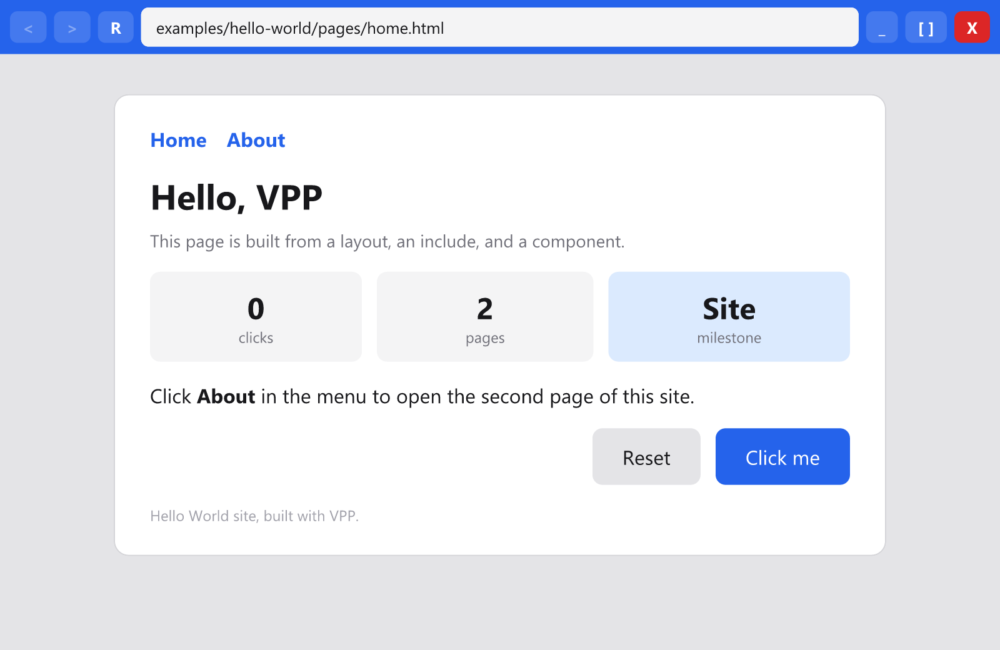
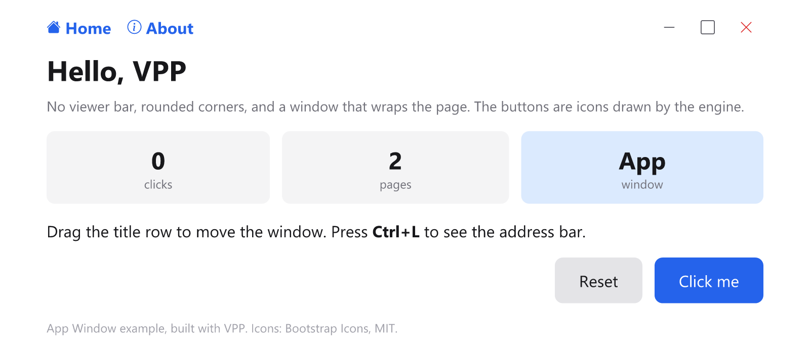

# VPP — Viewer Package Platform

**VPP (Viewer Package Platform)** is an experimental lightweight web viewer and application platform.

> **Written in Rust. The Windows viewer works today; macOS and Linux are next.** See [docs/rust-port.md](docs/rust-port.md) for the plan, [ARCHITECTURE.md](ARCHITECTURE.md) for how the code is organised, and [CONTRIBUTING.md](CONTRIBUTING.md) to help.

It combines familiar web technologies with a lightweight native viewer, application runtime, packaging system, secure update mechanism, and development tools.

<p>
  
  
</p>

## Core Idea

**One `.vpp` file is one page.** A VPP application, or site, is a folder of page packages that link to each other, the way web pages link to each other.

Development:

```text
pages/home.html  +  layouts, includes, components, CSS, JavaScript
   ↓
VPP Compiler        expands the layout and components into the page
   ↓
dom.bin  style.bin  code.bin
   ↓
VPP Packager        hashes, signs
   ↓
home.vpp
```

Execution:

```text
home.vpp (local file or URL)
 ↓
VPP Viewer
 ↓
Verify signature, publisher, and resource hashes
 ↓
Load resources
 ↓
Run the page's JavaScript
 ↓
Display page
 ↓
Click a link to profile.vpp → same steps for that page
```

Layouts, includes, and components exist only in the source tree. The compiler dissolves them into each page, so a page package is complete on its own.

## Pages, Sites, and Downloads

```text
my-site/                          site/                        (any static server)
├── vpp.json                      ├── home.vpp
├── pages/home.html          →    ├── profile.vpp
├── pages/profile.html            ├── home.vppm     manifests for update checks
├── layouts/main.html             ├── profile.vppm
├── components/user-card/         └── res/          resources by SHA-256,
├── styles/global.css                 ├── 3f9a…     shared between pages
└── scripts/app.js                    └── b87a…
```

- **Pages download on demand.** Opening `home.vpp` fetches only what home needs. `profile.vpp` is fetched the first time it is visited. A site with fifty pages costs one page's download to start using.
- **Shared resources download once.** Resources are stored by hash. Two pages that use the same stylesheet reference the same `style.bin`, which is downloaded and kept once.
- **Downloaded pages stay until they change.** Every visited page lives in the viewer's store on disk. Reopening it costs one small request for the manifest; if nothing changed, the page runs from disk. If the server is unreachable, the page runs from disk anyway.
- **Updates are per resource.** When a page's manifest shows a new version, only the resources whose hashes differ are downloaded. Older versions offered by a server are refused.
- **Each page is its own program.** Moving to another page ends the current page's JavaScript and starts the next page's, as on a classic multi-page website. State that must survive navigation goes through the storage API.
- **One publisher per site.** All pages of a site carry the site id and are signed with the same key. The viewer pins that key to the site id on first use.

## Viewer Concept

The viewer is a frameless window whose frame, the **shell**, is itself a VPP page drawn by the VPP engine: back, forward, reload, the address field, and the minimize, maximize, and close buttons. Sites cannot style the shell, because it is a separate document with its own stylesheet, which is what stops a page from faking the address bar.

When opened without content:

```text
┌───────────────────────────────────────────────┐
│ < > R  Enter a page address          _ [ ] X  │  shell
├───────────────────────────────────────────────┤
│ VPP Viewer                                    │  start page
│ Enter the address of a page in the bar above  │
│                                               │
└───────────────────────────────────────────────┘
```

A site can shape the shell from the `window` object of its `vpp.json`: a theme colour for the bar, `"addressBar": "hidden"` to drop the address field, or `"titleBar": false` to hide the whole bar and draw its own. Two rules hold regardless: Ctrl+L always reveals the full shell with the real address, and moving to a different site always reveals it too. A page can hide the frame for itself, never for the site it links to.

The address bar can be used for:

- URLs of `.vpp` pages
- VPP links
- Local `.vpp` pages
- Installed sites

After a page is opened, the address bar can automatically hide.

`Ctrl + L` can reveal and focus it again.

## Design Goals

VPP aims to provide:

- Minimal frameless viewer
- Navigation between pages, with back and forward
- HTML and CSS based interfaces
- Existing JavaScript development workflow
- Scripts checked at build time and shipped as source, never as bytecode, so a page cannot attack the viewer's engine
- `.vpp` page packaging
- Offline execution of every page already visited
- Signed applications
- Encrypted application resources
- Incremental updates
- Multi-window support
- Multi-instance support
- Optional tab support
- Developer debugging tools
- Cross-platform runtime architecture

## Repository Structure

```text
vpp/
├── README.md, LICENSE.md, COMMERCIAL-LICENSING.md, THIRD-PARTY-NOTICES.md
├── ARCHITECTURE.md       how the code is organised: read this first
├── CONTRIBUTING.md       how to build, test, and contribute
├── Cargo.toml            the Rust workspace
│
├── crates/               all Rust code, one crate per area
│   ├── vpp-format/       package format, signing, hashing
│   ├── vpp-template/     layouts, includes, components
│   ├── vpp-dom/          document tree
│   ├── vpp-style/        CSS
│   ├── vpp-layout/       layout
│   ├── vpp-paint/        painting, text, SVG
│   ├── vpp-script/       JavaScript
│   ├── vpp-updater/      page store and updates
│   ├── vpp-platform/     operating-system services, one file per OS
│   ├── vpp-viewer/       the viewer
│   ├── vpp-desktop/      desktop entry point (Windows now; macOS, Linux later)
│   ├── vpp-android/      Android entry point (later)
│   ├── vpp-ios/          iOS entry point (later)
│   ├── vpp-compiler/     the vppc tool
│   └── vpp-packager/     the vpppack tool
│
├── platforms/            per-OS app projects, installers, icons: windows, macos, linux, android, ios
├── examples/             example sites, also used as tests
├── tests/fixtures/       packages of every supported format version
└── docs/                 plan, formats, reference behaviour, design documents
```

Build with `cargo build`, then try an example:

```sh
cargo run -p vpp-desktop -- examples/hello-world/pages/home.html
cargo run -p vpp-desktop -- examples/app-window/pages/home.html
```

## Components

### VPP Viewer

`crates/vpp-viewer`, started by `crates/vpp-desktop`

Native VPP application responsible for displaying:

- VPP pages, local or from a URL
- address interface
- windows
- tabs
- navigation between pages

### VPP Runtime

`crates/vpp-dom`, `vpp-style`, `vpp-layout`, `vpp-paint`, `vpp-script`

Execution environment used by VPP applications.

Responsibilities include:

- JavaScript execution on QuickJS, from source
- DOM interaction
- application lifecycle
- event handling
- runtime permissions
- storage APIs
- window APIs
- networking APIs

### VPP Compiler

`crates/vpp-compiler`, with `crates/vpp-template`

Converts page source into VPP-compatible compiled resources, one set per page.

```text
pages/home.html + layouts + components + CSS + JavaScript
   ↓
VPP Compiler
   ↓
dist/home/dom.bin  style.bin  code.bin
```

Layouts, includes, and components are expanded into the page at this step. Development source files remain readable during development but are not distributed.

### VPP Packager

`crates/vpp-packager`, with `crates/vpp-format`

Creates one signed `.vpp` package per page, and publishes a site folder that any static server can host.

Example:

```text
pages/home.html, pages/profile.html
       ↓
     compile
       ↓
dist/home, dist/profile
       ↓
  package and sign
       ↓
home.vpp, profile.vpp  +  home.vppm, profile.vppm  +  res/
```

### VPP Updater

`crates/vpp-updater`

Handles installing pages from a URL and keeping them current.

Only resources that changed are downloaded, and a resource shared by several pages is downloaded once.

Example:

```text
Installed profile.vpp 1.0.0        Server offers profile.vpp 1.0.1

dom.bin      3f9a…                  dom.bin      3f9a…   unchanged
style.bin    b87a…                  style.bin    e21c…   changed
code.bin     dfb2…                  code.bin     dfb2…   unchanged

Download: style.bin only. Then home.vpp, which shares it, is current too.
```

### VPP SDK

`docs/sdk.md`

Defines APIs available to VPP applications.

Possible APIs include:

```text
VPP.window
VPP.storage
VPP.files
VPP.network
VPP.permissions
VPP.system
VPP.update
```

### VPP Tools

`docs/tools.md`

Development utilities such as:

- debugger
- inspector
- package inspector
- signature verifier
- compiler tools
- development launcher

### Examples

`examples/`

Contains small applications used to test VPP features and demonstrate development patterns.

## VPP Package

A `.vpp` file is one page:

```text
home.vpp
│
├── manifest       site id, page name, version
├── entries        name, size, SHA-256 of each resource
├── publisher key  Ed25519
├── signature      over the manifest and entries
│
├── dom.bin        the finished page, layout and components expanded
├── style.bin      the page's stylesheets, parsed
├── code.bin       the page's scripts: JavaScript source, syntax-checked
└── assets.bin     images and fonts (planned)
```

The exact byte layout is documented in [docs/formats/package.md](docs/formats/package.md).

## Security Model

Release VPP applications may use:

- cryptographic hashes
- publisher signatures
- encrypted binary resources
- application identifiers
- version verification
- rollback protection

A VPP Viewer should execute an application update only after verifying its publisher signature.

## Incremental Updates

A page never needs downloading in full after the first visit.

On each visit the viewer fetches the page's small manifest and compares resource hashes with its store.

```text
local hash
    ↓
compare
    ↓
remote hash
```

Only changed resources are downloaded. Unchanged ones, including those shared with other pages, are reused from disk. If the manifest cannot be fetched, the stored page runs.

## Template Syntax

Pages are assembled from layouts, includes, and components rather than written as single HTML files. Each page still compiles to its own `.vpp`; the layout and components are expanded into it. The syntax stays close to HTML and uses the `vpp-` prefix for its own elements:

```html
<vpp-layout src="/layouts/main.html">
    <vpp-fill slot="sidebar">
        <nav>...</nav>
    </vpp-fill>
    <vpp-fill>
        <user-card name="Bhupesh" role="Developer" />
    </vpp-fill>
</vpp-layout>
```

The full draft is in [docs/template-syntax.md](docs/template-syntax.md). It splits into two parts:

- **Build-time templating** — includes, layouts, slots and fills, components with literal properties, scoped component CSS, aliases. The compiler resolves all of it into a plain `dom.bin`; the viewer never sees a template. Planned next for the compiler.
- **Runtime templating** — expression properties, text and attribute bindings, event bindings, conditional rendering, component JavaScript and lifecycle. This needs a runtime framework and a design document of its own, starting with what `{{ }}` means and how updates are triggered.

The appendix of that document lists the decisions to settle before implementation, in particular the meaning of `{{ }}` and how self-closing custom tags and slots inside `<head>` survive HTML parsing.

## Development Mode

During development, applications remain easy to inspect and debug.

```text
HTML + CSS + JavaScript
          ↓
      VPP Dev Mode
          ↓
┌─────────────────────────────┐
│ Elements                    │
│ Console                     │
│ Sources                     │
│ Network                     │
│ Storage                     │
│ VPP Runtime                 │
└─────────────────────────────┘
```

Development mode may support:

- source debugging
- breakpoints
- console logging
- HTML inspection
- CSS inspection
- live reload
- hot reload
- runtime diagnostics

## Release Mode

A release build may perform:

```text
Validate
   ↓
Compile
   ↓
Optimize
   ↓
Generate binary resources
   ↓
Encrypt
   ↓
Hash
   ↓
Sign
   ↓
Package
   ↓
application.vpp
```

Debug information should normally remain outside the distributed package.

## Initial Development Roadmap

### Phase 1 — Viewer

- Native application window
- Frameless window
- Address/search bar
- Web rendering
- URL navigation
- Search engine integration
- Address bar auto-hide
- `Ctrl + L`
- Basic navigation

### Phase 2 — Runtime

- Application lifecycle
- Runtime API
- DOM bridge
- JavaScript execution

### Phase 3 — Compiler

- JavaScript syntax check at build time
- Scripts packed as source in `code.bin`
- Debug mapping

### Phase 4 — Package

- `.vpp` specification
- Manifest
- Resource packaging
- Local application loading

### Phase 5 — Security

- Publisher keys
- Digital signatures
- Resource hashes
- Encryption
- Rollback protection

### Phase 6 — Updates

- Update manifest
- Changed-resource detection
- Incremental downloads
- Atomic resource replacement

## Status

Early and experimental. Works today, on Windows:

- Viewer: a frameless window with its own shell bar (back, forward, reload, address field, window buttons), Ctrl+L, and per-site window options (theme, hidden bar, size, auto height, rounded corners)
- Rendering: VPP's own engine for HTML, the CSS cascade, block, inline, and flex layout, text, and inline SVG
- Scripts: JavaScript on QuickJS with DOM access, click events, `console.log`, and the `VPP.window` API, limited in memory and time
- Compiler (`vppc`): pages with layouts, includes, and components compiled into `dom.bin`, `style.bin`, and `code.bin`
- Packager (`vpppack`): `.vpp` packages with per-resource SHA-256 and Ed25519 publisher signatures
- Security: signature, pinned publisher key, and every hash checked before anything runs
- Updates: install from any static server by URL, download only changed resources, refuse older versions, run offline from the installed copy

Next: macOS and Linux, then Android and iOS ([docs/rust-port.md](docs/rust-port.md)). After that, the runtime half of the template specification (bindings, events, component scripts), storage, and assets.

Out of scope by design: rendering arbitrary websites. VPP pages target the VPP engine's documented HTML and CSS subset.

## License

**VPP — Viewer Package Platform** is source-available software under the VPP Source-Available License 1.0. See [LICENSE.md](LICENSE.md). The licence text is a draft pending legal review; the placeholders for the copyright holder, effective date, contact, and jurisdiction are still to be filled in.

### Free Use

VPP is free for:

- personal use;
- education;
- research;
- evaluation;
- non-commercial projects;
- commercial Products with less than **US$100,000 in Annual Gross Product Revenue**.

### Paid Commercial Use

When a Product or service using VPP reaches **US$100,000 or more in Annual Gross Product Revenue**, continued commercial use requires a paid VPP commercial license.

Current standard annual pricing:

| Product Revenue | VPP License |
|---:|---:|
| Below US$100,000 | Free |
| US$100,000 – US$499,999 | US$1,000/year |
| US$500,000 – US$1,999,999 | US$5,000/year |
| US$2,000,000 – US$9,999,999 | US$15,000/year |
| US$10,000,000 – US$49,999,999 | US$35,000/year |
| US$50,000,000+ | Contact for enterprise pricing |

Commercial licensing is based primarily on the revenue of the specific Product using VPP, not unrelated company revenue.

See:

- [LICENSE.md](LICENSE.md)
- [COMMERCIAL-LICENSING.md](COMMERCIAL-LICENSING.md)
- [THIRD-PARTY-NOTICES.md](THIRD-PARTY-NOTICES.md) for the licences of the libraries VPP builds on

### Sponsorship

Sponsorships and donations are optional support for VPP development and do not replace a required commercial license unless expressly agreed in writing.
